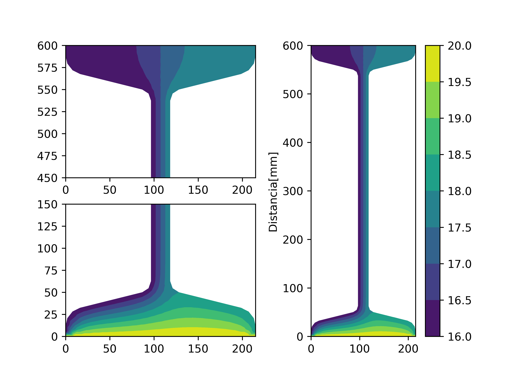

# CVFEM-and-FEM
Código para la resolución de un problema de "Distribución estacionaria de Temperaturas en la sección de una viga". El mismo fue resuelto por los métodos CVFEM (volúmenes finitos, con volumen de control) y FEM (método de elementos finitos)

Se analizaron distintos casos de estudio:
  * Con mallas estructuradas y NO estructuradas
  * Discretización por Elementos Triangulares (de 3 nodos) y Cuadrangulares (de 4 nodos)
  
  
  
  Se obtienen las soluciones de Distribución de Temperaturas estacionaria (en grados celsius)
  
  
El código implementado realiza:
 * Las simulaciones correspondientes,
 * Corrección de las normales de los elementos, de forma de seguir una numeración de los mismos en una dirección predefinida,
 * un informe acerca de la condición de la matriz global, la cantidad de nodos y elementos empleados en cada estudio,
 * Todas las gráficas correspondientes a cada uno de los casos de estudio.
